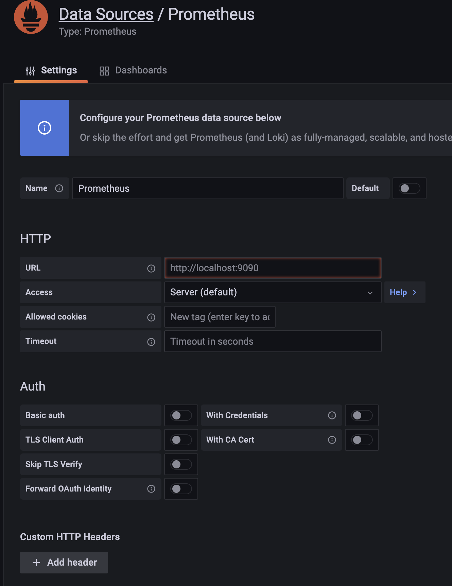
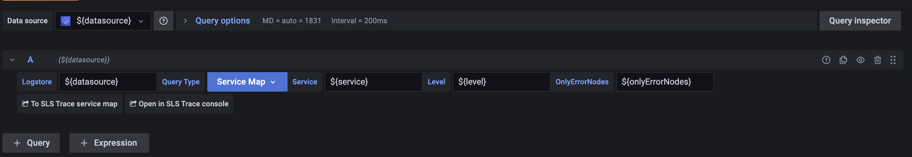
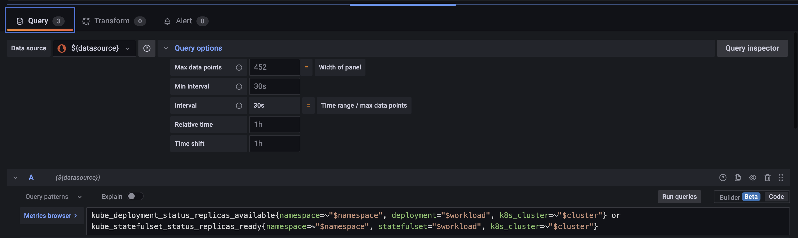
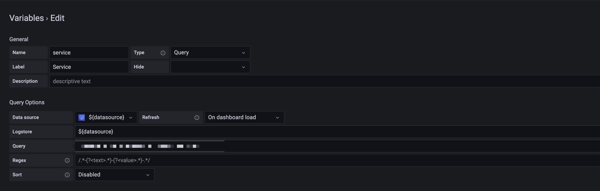
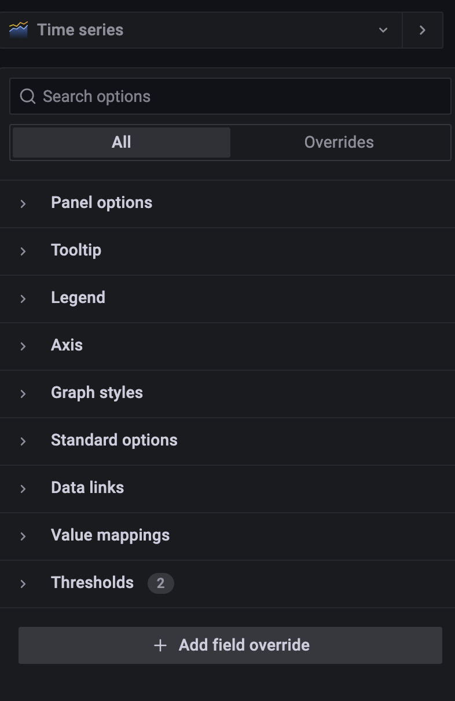

# grafana plugin使用指北

这里主要解释grafana plugin的构成，以便帮助理解grafana能实现的功能及其组件模块。

默认读者具备golang和一定前端工程基础知识。

## plugin 工程目录

可以参考官方[教程目录](https://github.com/grafana/grafana/tree/main/docs/sources/tutorials)

你可以用npx创建一个plugin工程

> npx @grafana/toolkit plugin:create my-plugin

它会问你要创建3个类型中的哪一个：

+ panel
+ datasource-plugin
+ backend-datasource-plugin

罗列一个工程目录就很好解释了（你也可以通过cmd直接建……）

+ pkg/main.go
+ src/plugin.json
+ package.json

panel就是绘图插件，其他两个就是一个datasource是否包含前端配置部分。

## datasource

### 后端部分

grafana的前后端有设定interface规范，后端会通过main里的datasource.Serve函数注册一个_长运行_的实例，(注意，此时拿到的config是从grafana启动配置上拿的)

```golang
type QueryDataRequest struct {
	// PluginContext the contextual information for the request.
	PluginContext PluginContext

	// Headers the environment/metadata information for the request.
	//
	// To access forwarded HTTP headers please use
	// GetHTTPHeaders or GetHTTPHeader.
	Headers map[string]string

	// Queries the data queries for the request.
	Queries []DataQuery
}
```

然后往struct上实现QueryData（和testDatasource……不过这个逻辑上不重要）,QueryData函数里前端传来的请求会被解析成[QueryDataRequest](https://github.com/grafana/grafana-plugin-sdk-go/blob/c7f540ca3f116a0e4f16a16147869ce2709ea119/backend/data.go#L40)，配置datasource时填写的config（比如查询的sls的endpoint，与AK/SK，或者prometheus的地址啥的）会在req的PluginContext里。具体在panel里执行的查询是一个[]DataQuery。后面前端的dataframe你往里继续找就行了。

剩下就是常规前后端交互玩法了。后端这块就没什么额外的东西了，具体跑啥逻辑都好编，反正没什么障碍。这里我们只需要知道每一个我们在Configuration里配置的datasource会是一个独立的plugin context跟着你的每个请求跑即可。

### 前端部分

其实plugin.json才是本体……前端的结构要更复杂一点，前端分三部分定义，你可以在src目录下找到module.ts文件，里面plugin主要有三个editor：(拿aliyun的sls举例因为它的代码都在一坨……)

+ configeditor
+ queryeditor
+ variablequeryeditor

```js
export var plugin = new DataSourcePlugin(DataSource)
    .setConfigEditor(ConfigEditor)
    .setQueryEditor(QueryEditor)
    .setVariableQueryEditor(VariableQueryEditor);
```

#### ConfigEditor



[ConfigEditor](https://github.com/aliyun/aliyun-log-grafana-datasource-plugin/blob/master/src/ConfigEditor.tsx) 定义datasource的配置界面，即PluginContext参数，比如AK/SK 查询的endpoint等。该值会伴随每一次查询被传递到后端的PluginContext。

#### QueryEditor



[QueryEditor](https://github.com/aliyun/aliyun-log-grafana-datasource-plugin/blob/master/src/QueryEditor.tsx) 定义查询面板，具体dom可以自己编，只看接口，这里你会拿到onchange(state)和onrunquery()两个事件trigger和query，即你自己写的value，通过onchange接口传递state挂给panel的下半部editor的控制器，调用onrunquery会将state做表达式解析（比如$value/$time等grafana自带的变量上下文）然后做成queryrequest发往后端。清楚前端的话不难理解，当你更换datasource时此处的state会被重置，所以state仅挂靠在下半部Query的dom结构上。所以这里会受到datasource的queryoptions影响。全局变量也仅在query执行时会被带入解析（此时会拿到全局变量），而且和隔壁的transform是两个不相关的dom。



query被提交给后端查询后返回，得到一个[]dataframe数组，交给隔壁transform进行无状态函数处理，把最后的[]dataframe扔给panel绘图，这个数组[]dataframe就是你tableview看到的东西的前一跳，为什么是前一跳后面解释。

#### VariableQueryEditor



[variable](https://github.com/aliyun/aliyun-log-grafana-datasource-plugin/blob/master/src/VariableQueryEditor.tsx) 全局变量添加时，选中该datasource时的变量部分，仅红框贴出的部分。

grafana的全局变量会体现在地址栏连接上，作为全局state，在你执行query时，会作为全局变量灌入，此state挂载在dashboard的dom上。

## panel图表组件



[panel类型插件](https://github.com/topics/grafana-panel-plugin)，比如你看到的table啦，time series，柱状图之类的都算此类，这个前端写组件的同学就更熟悉了……接受一个[]data数据选择自己要的数据格式，然后绘图即可，主面板不需要任何其他全局变量传入，只有隔壁config部分会拿到全局变量和transform完传入的[]data做最后的value mapping，然后就扔进图表的panel绘图了。

- - -

至此grafana plugin的代码结构讲解完了。接下来你想要达成的功能，我们可以依据上述内容推理在grafana的哪一个功能模块，然后翻一翻或者问google来完成……

比如全局的变量查询完会填入地址栏，然后dashboard从地址栏捕获参数初始化全局state，所以无法动态实时更改。也同理，由于变量可以文本输入，即便selector选项里没有出现该字段值，我们也可以通过地址栏输入变量来强行将值改选出来。

下面举一些遇到过的简单推理逻辑：

# FAQ

1. 我想在时序图表中看到数据的平均值最大值最小值。

A：显然在panel的config配置里。因为查询是一个editor，它不具备更改图表功能的结果。

2. 我想在时序图里显示左右y轴各1根轴。

A：显然在panel的config配置里找。道理同上。

3. 我想基于查询结果，添加计算一个平均值。

A：transform里，editor无法更改查询结果，图表的配置只能做map，不会更改查询的数据条数。

4. 我想让数字小于某个值的时候显示不同的颜色。

A：panel的config里，threshold，因为也不可能在其他的位置了……

5. 我想把查询的结果重命名。

A：三种方式皆可，1查询本身语句可以重命名字段如sql的as。2transform无状态函数里可以改变数据的名字。3进图表前配置也可以对字段做重命名，甚至可以正则匹配。
